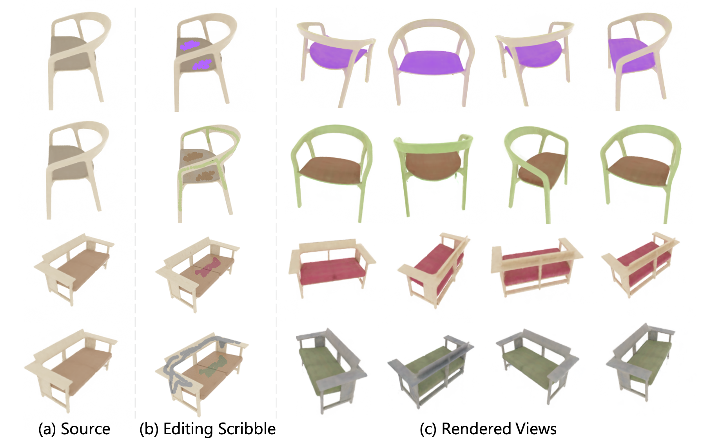
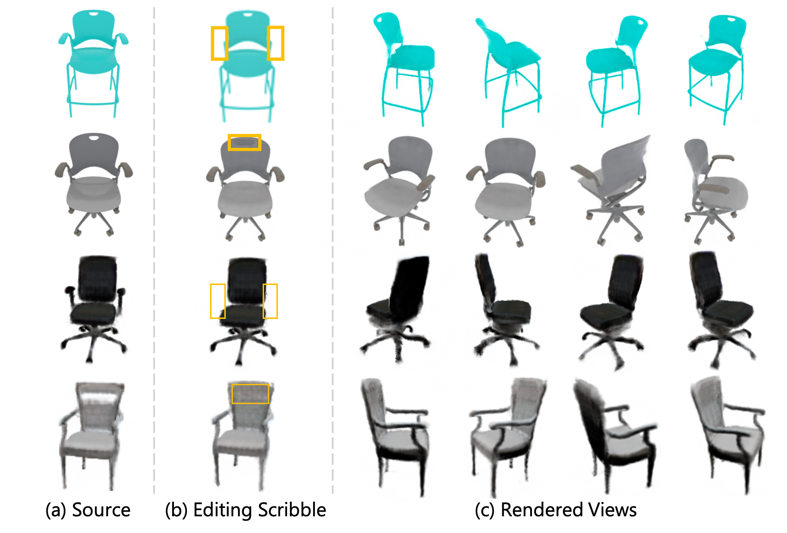
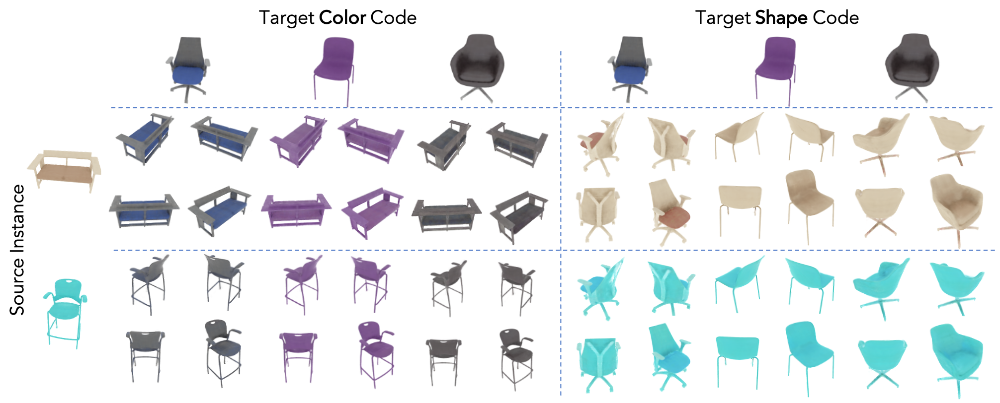
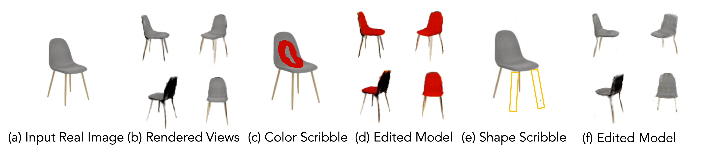
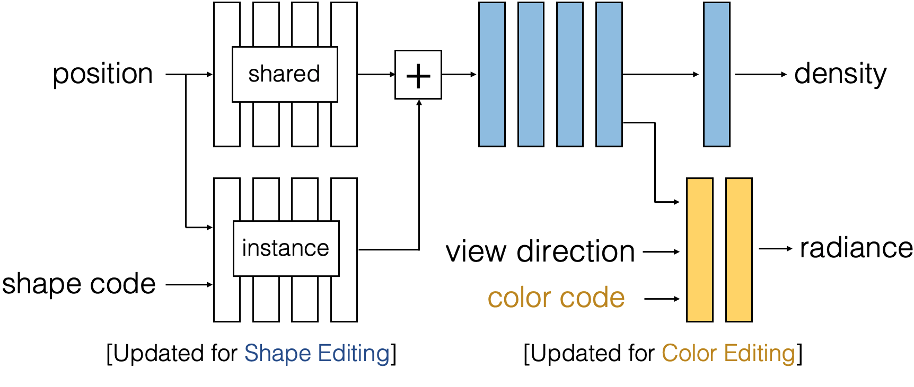

# Editing Conditional Radiance Fields

#### [Project](http://editnerf.csail.mit.edu/) |   [Paper](http://editnerf.csail.mit.edu/paper.pdf) |   [Video](https://www.youtube.com/watch?v=9qwRD4ejOpw) |   [Demo](https://colab.research.google.com/github/stevliu/editnerf/blob/master/editnerf.ipynb)

**Editing Conditional Radiance Fields** <br>
[Steven Liu](http://people.csail.mit.edu/stevenliu/),
[Xiuming Zhang](http://people.csail.mit.edu/xiuming/),
[Zhoutong Zhang](https://ztzhang.info/),
[Richard Zhang](https://richzhang.github.io/),
[Jun-Yan Zhu](https://www.cs.cmu.edu/~junyanz/),
[Bryan Russell](http://bryanrussell.org/) <br>
MIT, Adobe Research, CMU<br>
in arXiv 2021.

<a href="http://editnerf.csail.mit.edu/">


## Editing Results

<br>
Our method propagates sparse 2D user scribbles to fill an object region, rendering the edit consistently across views. The user provides a color, a foreground scribble for the region to change, and a background scribble for regions to keep unchanged. To conduct the edit, we optimize a reconstruction-based loss to encourage the model to change the color at the foreground scribble, but maintain the color on the background scribbles.


<br>
Our method propagates 2D user edits to remove or add an object part, propagating the 2D edit consistently across views. For shape removal, the user scribbles over a region of the object to remove. To conduct the removal, we optimize both a reconstruction loss and a density-based loss, encouraging the model to remove density at the scribbled regions. For shape addition, the user selects an object part to paste into the instance. To conduct the addition, we optimize a reconstruction loss similar to the one used for color editing.


<br>
Our method can transfer shape and color between object instances simply by swapping the color and shape codes between instances.



<br>
Our method is able to render novel views of the real object instance and conduct color and shape editing on the instance.


## Method

<br>

To propagate sparse 2D user scribbles to novel views, we learn a rich prior of plausible-looking objects by training a single radiance field over several object instances. Our architecture builds on NeRF in two ways. First, we introduce shape and color codes for each instance, allowing a single radiance field to represent multiple object instances. Second, we introduce an instance independent shape branch, which learns a generic representation of the object category. Due to our modular architecture design, only a few components of our network need to be modified during editing to effectively execute the user edit.

## Getting Started

### Installation
- Clone this repo:
```bash
git clone https://github.com/stevliu/editnerf.git
cd editnerf
```

- Install the dependencies
```bash
bash scripts/setup_env.sh
```

- Obtain pre-trained models and editing examples:
```bash
bash scripts/setup_models.sh
```

- Optionally, download the relevant datasets. This step is required to evaluate edits and for training/testing a conditional radiance field:
```bash
bash scripts/setup_data.sh
```

Our code is tested on using Python 3.6, PyTorch 1.3.1, and CUDA 10.1.


## Editing a Conditional Radiance Field

To conduct your own edits, please check out our demo. Alternatively, you can run the demo locally using `jupyter notebook` and using the notebook `ui/editing.ipynb`.

To execute the edits used in our paper, please run:
```bash
bash scripts/editing_experiments.sh
```

To evaluate the edits used in our paper, please run:
```bash
bash scripts/evaluate_edits.sh
```

Feel free to check out additional editing examples, which can be run via `scripts/additional_edits.sh`.


## Learning a Conditional Radiance Field

### Training

To train a conditional radiance field on the PhotoShapes dataset, please run:
```bash
python run_nerf.py --config configs/photoshapes/config.txt --skip_loading
```
The `--skip_loading` flag tells the script not to load the pretrained weights during training.

To train on other datasets, or use a different model architecture, you can replace the config file with your own. Feel free to check out example config files under `configs/`. For additional training options, please visit `inputs.py`.

### Evaluation

To render train and test views from a conditional radiance field, you can run:
```bash
python test_nerf.py --config config-file --render_test --render_train
```
where `config-file` is the same config file used during training.

Then, to run evaluation metrics on the rendered samples, you can run:
```bash
python utils/evaluate_reconstruction.py --expdir path-to-log-dir
```

To evaluate the conditional radiance fields used in our paper, please run:
```bash
bash scripts/reconstruction_experiments.sh
```

## Training and Editing your own models

To train a model on a different dataset, first setup the directory to store the dataset. The structure should be
```bash
data/
    datasetname/
        instances.txt
        instance_name1
            images
            transforms_train.json
            transforms_val.json
            trainsforms_test.json
        instance_name2
            ...
        ...
```
Each instance subdirectory should contain `transforms_train.json`, `transforms_test.json`, and `transforms_val.json`. Each of these `.json` files should contain the camera focal, as well as the camera extrinsics for each image. Please refer to `data/photoshapes/shape09135_rank02/transforms_train.json` for an example. `instances.txt` should contain a list of the instance names.

Then you can run `python run_nerf.py --config config-file` to train a conditional radiance field, and evaluate it using the instructions in the above section.

To edit the conditional radiance field, first make a directory in `ui` which will contain all the relevant data for the model. Then, copy over the config file, model weights, camera intrinsics, and camera extrinsics (last three are automatically saved under `logs/`). The directory structure should be
```bash
ui/
    datasetname/
        model.tar
        hwfs.npy
        poses.npy
        config.txt
```
Please refer to `ui/photoshapes` for an example.


## Editing a real image
To edit a real image, we first decide on a base model to finetune to the real image. In our experiments, we use the Dosovitskiy chairs model. Then, visually estimate the pose of the image. One way to do this is by finding the nearest neighbor pose in the training set of the base model. Then, construct the dataset folder containing the `.json` files mentioned in the above section.

The directory structure should be
```bash
realchairname/
    images
    transforms_train.json
    transforms_val.json
    trainsforms_test.json
```
As an example, please refer to `data/real_chairs/shape00001_charlton`.

To finetune the radiance field on this image, you can run
```bash
python run_nerf.py --config base-config --real_image_dir data-dir --savedir savedir --n_iters_code_only 1000 --style_optimizer lbfgs
```
where `base-config` is the model to fit, `data_dir` is the directory containing the real images, and `savedir` is where you want to save the results. The last two flags tell the training script to first finetune the shape and color codes using LBFGS. Please refer to `scripts/reconstruction_experiments.sh` for an example.

To edit this instance, copy the finetuned model weights from `savedir` and to a subdirectory of the base model in `ui`.  Then, copy over the camera intrinsics and camera extrinsics (located under `logs/`). The directory structure should be
```bash
ui/
    basemodel/
        realchair/
            model.tar
            hwfs.npy
            poses.npy
```
Please refer to `ui/dosovitskiy_chairs/real_chair` for an example.

## Acknowledgments

This codebase is heavily based on the [nerf-pytorch](https://github.com/yenchenlin/nerf-pytorch) code base,  and our user interface is heavily based on the [GAN rewriting](https://github.com/davidbau/rewriting) interface. We also use LBFGS code from [PyTorch-LBFGS](https://github.com/hjmshi/PyTorch-LBFGS) and job scheduling code from the [GAN seeing](https://github.com/davidbau/ganseeing) codebase.

We thank all authors for the wonderful code!
## Citation
If you use this code for your research, please cite the following work.

```bash
@misc{liu2021editing,
      title={Editing Conditional Radiance Fields}, 
      author={Steven Liu and Xiuming Zhang and Zhoutong Zhang and Richard Zhang and Jun-Yan Zhu and Bryan Russell},
      year={2021},
      eprint={2105.06466},
      archivePrefix={arXiv},
      primaryClass={cs.CV}
}
```
